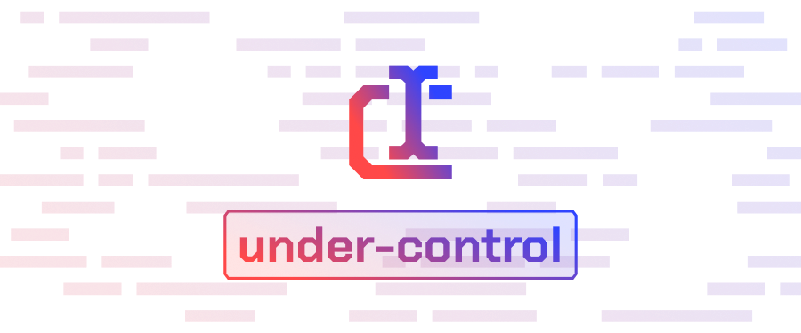

  <picture>
    <source media='(prefers-color-scheme: dark)' srcset='assets/social/under-control-banner.png'>
    
  </picture>

  <h1 align='center'>under-control</h1>

  Are you losing sanity every time you need to make a form? Are you have enough of all antipatterns and cursed frameworks in React? Screw that! Treat all forms and inputs as a recursive composable control!

## What is included?

- **Hook that binds controls to state**
- **Hook that implements simple form submitting / validation logic**
- **Decorator that makes any passed component controllable**
- ... and nothing more

## License

[MIT](LICENSE)
